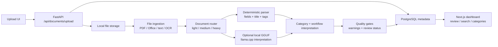

# DocuParse

DocuParse is a local-first AI document understanding workspace. It helps users upload messy real-world documents, extract useful text and fields, organize them into meaningful categories, and review the result before trusting it.

The project is built as a portfolio-quality full-stack system rather than a simple OCR demo. It combines a Next.js review UI, FastAPI processing backend, PostgreSQL persistence, Docker local infrastructure, deterministic parsing, quality gates, and optional local GGUF interpretation through llama.cpp.

## Portfolio Snapshot

- **Project type:** full-stack AI document processing workspace
- **Core engineering focus:** multi-format ingestion, local inference, reviewable AI output, search/category consistency, and Dockerized local infrastructure
- **Best demo path:** upload a PDF guide and an XLSX implementation tracker, inspect the provider chain, edit a category, then verify search/review/notifications
- **Architecture docs:** [docs/architecture.md](docs/architecture.md)
- **Demo script:** [docs/demo.md](docs/demo.md)

## Problem

Personal and small-team document collections are usually hard to search because files arrive in many formats: receipts, PDFs, spreadsheets, invoices, setup guides, resumes, notices, and notes. OCR alone gives raw text, but users still need category, title, summary, important dates, review status, and a way to correct mistakes.

DocuParse focuses on that workflow:

- turn heterogeneous documents into searchable structured records
- keep AI/heuristic interpretation visible and editable
- route uncertain documents into review instead of silently trusting weak output
- organize documents by category folders rather than raw filenames or file types

## Who It Is For

DocuParse is designed for a local document workflow: a student, researcher, freelancer, small team, or developer who wants to organize document files without sending everything to a hosted SaaS. For portfolio purposes, it demonstrates full-stack engineering and practical AI application architecture.

## Key Features

- Multi-format uploads: images, PDFs, DOCX, PPTX, XLSX, CSV, TXT, Markdown, JSON, XML, and HTML
- Text-layer PDF extraction, scanned-PDF OCR, Tesseract image OCR, Office extraction, and structured text extraction
- Local GGUF-backed interpretation through llama.cpp, with deterministic fallback behavior
- Provider-chain and field-source visibility for debugging and trust
- Category-first organization with editable category folders
- Review queue for uncertain or warning-producing documents
- Search across title, summary, workflow summary, source/merchant, raw extracted text, original filename, and category
- Filters for category, file type, processing status, date range, amount range, favorites, and review state
- Document detail page with original file preview/link, extracted text, AI result, workflow panel, editable fields, and category selector
- Notifications for processed, processing, review-needed, and failed documents
- Reprocess, confirm, mark needs review, favorite, bulk download, bulk delete, CSV export, and per-document JSON export
- Evaluation harness for regression-checking title selection, category interpretation, summaries, action items, and provider-chain behavior

## Supported File Types

| Family | Extensions | Processing path |
| --- | --- | --- |
| Images | `png`, `jpg`, `jpeg`, `webp`, `tiff` | OCR with Tesseract/OpenCV; optional vision-style heavy path |
| PDFs | `pdf` | Text-layer extraction first; scanned-page rendering/OCR when needed |
| Office | `docx`, `pptx`, `xlsx` | Direct Office text/table extraction |
| Tabular | `csv` | Structured row extraction |
| Text/markup | `txt`, `md`, `json`, `xml`, `html` | Direct text extraction and normalization |
| Partial legacy | `rtf`, `eml`, OpenDocument-like formats | Best-effort extraction with review warnings |

## Main Workflow

1. Upload a document from the dashboard or upload page.
2. The backend validates the file and stores the original in local storage.
3. Ingestion normalizes the file into text, metadata, optional page images, and extraction warnings.
4. A lightweight router decides whether direct parsing is enough or whether heavier AI interpretation is useful.
5. The parser and interpretation layer extract title, category, fields, summary, action items, warnings, and workflow metadata.
6. Quality gates decide whether the document should be marked ready or needs review.
7. The user reviews the original, extracted text, AI result, provider chain, category, and workflow panel.
8. The user confirms, edits, reprocesses, exports, searches, filters, or moves the document into another category.

## Architecture



High-level subsystems:

- `frontend/`: Next.js App Router UI for dashboard, upload, document library, categories, review queue, notifications, and document detail editing.
- `backend/app/api/`: FastAPI routes for uploads, document CRUD, category folders, notifications, export, and bulk actions.
- `backend/app/services/file_ingestion.py`: normalizes PDFs, images, Office files, spreadsheets, text, and partial formats.
- `backend/app/services/document_router.py`: chooses a light, medium, or heavy processing path.
- `backend/app/services/parser.py`: deterministic extraction for dates, amounts, titles, categories, tags, and document type.
- `backend/app/services/document_interpretation_service.py`: orchestrates heuristic and optional AI interpretation.
- `backend/app/services/category_interpretation.py`: maps extracted content into portfolio-visible categories and workflow hints.
- `backend/app/services/workflow_enrichment.py`: produces summaries, action items, warnings, dates, urgency, and follow-up flags.
- `backend/app/services/quality_evaluation.py`: scores extraction quality and decides whether review is needed.
- `backend/eval/`: generated sample corpus and quality evaluation reports.

See [docs/architecture.md](docs/architecture.md) for a deeper walkthrough.

## Why This Is Technically Interesting

DocuParse is interesting because it treats document AI as a system problem, not just a model call.

- It separates file ingestion, routing, parsing, AI interpretation, quality evaluation, and workflow enrichment.
- It preserves provider-chain visibility so a reviewer can see whether a result came from PDF text extraction, OCR, heuristic fallback, or local GGUF interpretation.
- It uses deterministic rules and quality gates to reduce blind trust in AI output.
- It supports a realistic set of file formats instead of only clean demo images.
- It includes a human review loop with editable categories and fields.
- It runs locally with Docker and can use a local GGUF model mounted outside the image.

## Tech Stack

Frontend:

- Next.js App Router
- TypeScript
- Tailwind CSS
- React Hook Form
- Sonner toasts
- lucide-react icons

Backend:

- FastAPI
- Python 3.11
- Pydantic
- SQLAlchemy
- Alembic
- PostgreSQL
- Tesseract OCR, pytesseract, Pillow, OpenCV
- PyMuPDF, pypdf, python-docx, python-pptx, openpyxl
- llama-cpp-python for optional local GGUF interpretation

Infrastructure:

- Docker Compose for local development
- Production-lite Docker Compose with nginx reverse proxy
- Local mounted model directory for GGUF weights

## Run Locally With Docker

Place a GGUF model at:

```text
models/gguf/gemma-3-4b-it-q4_0.gguf
```

Then start the local stack:

```bash
docker compose --profile backend up --build
```

Open:

- Frontend: http://localhost:3001
- Backend API docs: http://localhost:8001/docs
- Health check: http://localhost:8001/health

The backend runs Alembic migrations on startup. Uploaded files and PostgreSQL data are stored in Docker volumes.

## Local Development Without Full Stack

Backend:

```bash
docker compose up db
cd backend
python3.11 -m venv .venv
source .venv/bin/activate
pip install -r requirements.txt
pip install -r requirements-llama.txt
cp .env.example .env
alembic upgrade head
uvicorn app.main:app --reload --port 8001
```

Frontend:

```bash
cd frontend
npm install
cp .env.example .env.local
npm run dev -- --port 3001
```

Run focused backend tests:

```bash
cd backend
source .venv/bin/activate
pip install -r requirements-dev.txt
PYTHONPATH=. pytest
```

## Demo Walkthrough

See [docs/demo.md](docs/demo.md) for a fuller script. A short portfolio walkthrough can use this flow:

1. Start Docker and open the dashboard.
2. Upload a PDF setup guide or installation manual.
3. Open the document detail page and show extracted text, category, summary, review status, and provider chain.
4. Upload an XLSX implementation tracker.
5. Show that it becomes an implementation/project-planning category rather than a profile record just because a cell contains the word `profile`.
6. Change a document category and verify category filtering/search still finds it.
7. Open notifications and the review queue.
8. Run or show `backend/eval/reports/latest-gemma.md` to demonstrate regression evaluation.

Prepare a richer screenshot dataset with:

```bash
PYTHONPATH=backend backend/.venv/bin/python backend/scripts/prepare_portfolio_demo.py
```

## Portfolio Evidence To Add

Recommended screenshots or GIFs:

- Dashboard with upload dropzone and status cards
- Document detail page showing provider chain and editable category
- Category folders page
- Search/filter results after changing a category
- Notifications page
- Evaluation report snippet

Recommended metrics to mention in a portfolio writeup:

- supported file families
- number of sample evaluation documents
- before/after quality score from evaluation reports
- provider-chain examples
- examples of review-required warnings

## Known Limitations

- Authentication pages are not wired to a real user system; the current project is a local-first workspace, not a multi-user SaaS.
- Processing is inline by default, so large OCR/GGUF jobs can make upload requests slow.
- Search uses straightforward database filtering rather than a dedicated full-text search index.
- Notifications are currently derived from document state, not persisted as an event stream.
- Category interpretation combines deterministic heuristics with optional model output; it is designed for reviewability, not perfect automatic classification.
- Production deployment docs are intentionally lightweight and do not include TLS termination or object storage.

## Useful Commands

Run the fallback quality evaluation:

```bash
cd backend
PYTHONPATH=. python scripts/run_quality_eval.py --mode fallback --label fallback-check
```

Run a GGUF-backed evaluation against a running backend:

```bash
cd backend
PYTHONPATH=. python scripts/run_quality_eval.py \
  --mode gemma \
  --backend-url http://localhost:8001 \
  --label gguf-smoke \
  --limit 2 \
  --cleanup
```

Confirm the local GGUF path after upload by checking a document detail response. The `provider_chain` should include:

```text
ai_interpretation_gemma_gguf
```

## Future Improvements

High-value next steps:

- Background processing queue for long OCR/GGUF jobs
- Small API and frontend smoke test suite
- Architecture/demo screenshots in `docs/`
- Full-text PostgreSQL search indexes
- Structured processing logs with durations and route/provider metadata

Lower-priority ideas:

- Real multi-user authentication
- Cloud object storage
- More analytics dashboards
- More niche document categories
