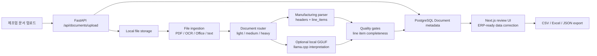

# DocuParse

DocuParse는 한국 중소 제조업체의 발주서, 견적서, 거래명세서, 납품서를 AI로 읽고 ERP/엑셀 입력용 구조화 데이터로 변환하는 문서 업무 자동화 플랫폼입니다.

DocuParse is an AI-powered document automation platform that converts manufacturing purchase, quotation, delivery, and transaction documents into structured ERP/Excel-ready data with human review and confidence tracking.

## 제품 개요

한국 중소 제조업체의 구매/납품 업무에서는 PDF, 이미지, 엑셀, 워드 형태의 발주서, 견적서, 거래명세서, 납품서가 매일 들어옵니다. 담당자는 거래처명, 문서번호, 발행일, 납기일, 품목명, 품목 코드, 규격, 수량, 단가, 공급가액, 세액, 총액을 ERP나 엑셀에 다시 입력해야 합니다.

DocuParse는 이 반복 입력 업무를 줄이기 위한 MVP입니다. 문서를 업로드하면 AI와 휴리스틱 파이프라인이 문서 유형을 분류하고 핵심 업무 데이터를 추출합니다. 신뢰도 낮은 필드는 검토 필요로 표시되며, 사용자는 원본 문서와 원문 텍스트를 보면서 구조화된 데이터를 수정하고 확정할 수 있습니다. 확정된 데이터는 CSV, Excel, JSON으로 내보내 ERP/엑셀 입력에 사용할 수 있습니다.

## 우선 지원 문서

- `purchase_order`: 발주서
- `quotation`: 견적서
- `transaction_statement`: 거래명세서
- `delivery_note`: 납품서

확장 문서 타입:

- `invoice`: 인보이스/세금계산서
- `packing_list`: 포장명세서
- `inspection_report`: 검사성적서
- `contract`: 계약서
- `general_document`: 일반 문서

## 추출 대상 필드

문서 기본 정보:

- 문서 유형
- 공급업체
- 고객사
- 문서번호
- 발행일
- 납기일
- 공급가액
- 세액
- 합계금액

품목 정보인 `line_items`가 가장 중요합니다.

각 품목 행은 다음 필드를 포함합니다.

- `item_name`: 품목명
- `item_code`: 품목 코드
- `specification`: 규격
- `quantity`: 수량
- `unit`: 단위
- `unit_price`: 단가
- `supply_amount`: 공급가액
- `tax_amount`: 세액
- `line_total`: 합계금액

품목 정보가 없거나 수량, 단가, 합계금액이 불확실하면 `review_required=True` 또는 `needs_review` 상태로 이동합니다.

## 핵심 기능

- PDF, 이미지, 엑셀, 워드, CSV, TXT, JSON, XML, HTML 업로드
- OCR/text extraction, Office extraction, PDF text-layer extraction 유지
- 문서 라우팅: light / medium / heavy 처리 경로
- 제조업 문서 유형 분류
- 거래처, 문서번호, 날짜, 납기일, 금액, 품목 테이블 추출
- `provider_chain`과 `field_sources`를 통한 추출 경로 추적
- 품질 게이트와 `needs_review` 상태
- ERP-ready data review UI
- 사람이 품목 수량, 단가, 총액을 수정한 뒤 확정 처리
- CSV, Excel, JSON 내보내기
- 검색: 파일명, 거래처명, 품목명, 문서번호, 원문 텍스트

## 데모 흐름

1. 사용자가 발주서 PDF 또는 이미지 파일을 업로드한다.
2. 시스템이 문서 유형을 발주서로 분류한다.
3. 공급업체, 고객사, 발주번호, 발주일, 납기일을 추출한다.
4. 품목 테이블에서 품목명, 품목 코드, 규격, 수량, 단가, 공급가액, 세액, 총액을 추출한다.
5. 신뢰도 낮은 필드는 “검토 필요”로 표시한다.
6. 사용자가 틀린 수량이나 단가를 수정한다.
7. 문서를 “확정 완료” 상태로 변경한다.
8. 최종 결과를 CSV, Excel, JSON 중 하나로 내보낸다.

## Architecture



기존 DocuParse의 핵심 구조는 유지됩니다.

- `frontend/`: Next.js App Router UI
- `backend/app/api/`: FastAPI document API
- `backend/app/services/file_ingestion.py`: 파일 타입별 ingestion
- `backend/app/services/document_router.py`: 처리 경로 결정
- `backend/app/services/parser.py`: 제조업 문서 필드와 품목 행 휴리스틱 추출
- `backend/app/services/ai_document_understanding.py`: AI/fallback 구조화 결과
- `backend/app/services/quality_evaluation.py`: 품목 행과 핵심 필드 품질 게이트
- `backend/eval/`: 회귀 평가 코퍼스와 리포트

## Tech Stack

Frontend:

- Next.js App Router
- TypeScript
- Tailwind CSS
- React Hook Form
- Sonner
- lucide-react

Backend:

- FastAPI
- Python 3.11
- Pydantic
- SQLAlchemy
- Alembic
- PostgreSQL
- Tesseract OCR, pytesseract, Pillow, OpenCV
- PyMuPDF, pypdf, python-docx, python-pptx, openpyxl
- llama-cpp-python optional GGUF interpretation

## Run Locally With Docker

GGUF 모델을 사용할 경우 다음 위치에 둡니다.

```text
models/gguf/gemma-3-4b-it-q4_0.gguf
```

로컬 스택 실행:

```bash
docker compose --profile backend up --build
```

Open:

- Frontend: http://localhost:3001
- Backend API docs: http://localhost:8001/docs
- Health check: http://localhost:8001/health

## Local Development

Backend:

```bash
docker compose up db
cd backend
python3.11 -m venv .venv
source .venv/bin/activate
pip install -r requirements.txt
pip install -r requirements-llama.txt
cp .env.example .env
alembic upgrade head
uvicorn app.main:app --reload --port 8001
```

Frontend:

```bash
cd frontend
npm install
cp .env.example .env.local
npm run dev -- --port 3001
```

Backend tests:

```bash
cd backend
source .venv/bin/activate
pip install -r requirements-dev.txt
PYTHONPATH=. pytest
```

## Known Limitations

- 현재 기본 처리 방식은 inline processing이므로 큰 OCR/GGUF 작업은 업로드 응답을 느리게 만들 수 있습니다.
- 제조업 품목 테이블 추출은 MVP 휴리스틱과 AI fallback 중심입니다. 복잡한 병합 셀, 회전 스캔, 저화질 팩스 문서는 검토 필요로 보낼 수 있습니다.
- 실제 ERP 연동 API는 아직 없고, CSV/Excel/JSON 내보내기를 우선 지원합니다.
- 인증은 로컬 포트폴리오 수준의 제품 shell입니다.
