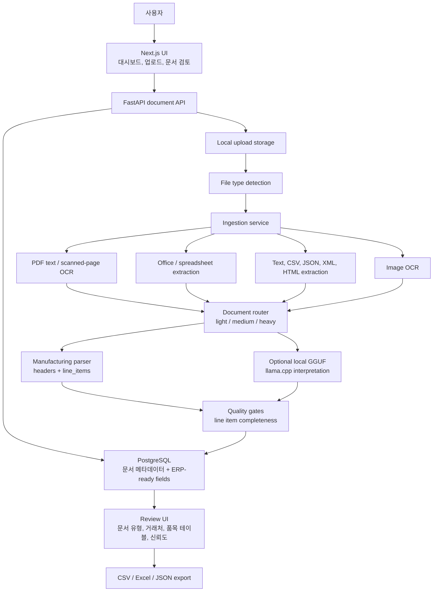

# DocuParse Architecture

DocuParse는 한국 중소 제조업체의 구매/납품 문서를 ERP/엑셀 입력용 구조화 데이터로 변환하는 로컬 우선 문서 자동화 시스템입니다. 백엔드는 파일 ingestion, OCR/text extraction, 문서 라우팅, 제조업 필드 추출, AI fallback, 품질 게이트, 저장을 담당합니다. 프론트엔드는 업로드, 검토, 품목 테이블 수정, 확정 처리, 검색, 내보내기를 담당합니다.

## System Diagram



## Processing Pipeline

1. **Upload and validation**
   API가 업로드 파일을 받고 지원 확장자와 크기를 검증한 뒤 원본 파일을 로컬 저장소에 보관합니다.

2. **File ingestion**
   PDF, 이미지, Office, CSV, 텍스트/마크업 문서를 `NormalizedDocument` 형태로 정규화합니다. 정규화 결과에는 원문 텍스트, 추출 방식, OCR confidence, extraction warnings, 파일 메타데이터가 포함됩니다.

3. **Routing**
   `LightweightDocumentRouter`가 텍스트 품질과 파일 성격에 따라 light, medium, heavy 처리 경로를 결정합니다.

4. **Manufacturing parsing**
   `DocumentParser`가 발주서, 견적서, 거래명세서, 납품서, 세금계산서, 포장명세서, 검사성적서, 계약서를 분류하고 공급업체, 고객사, 문서번호, 발행일, 납기일, 금액, `line_items`를 추출합니다.

5. **AI fallback / refinement**
   로컬 GGUF 또는 fallback 휴리스틱 해석이 부족한 필드를 보완합니다. 실패하더라도 provider chain에 fallback 사실을 남기고 시스템은 계속 동작합니다.

6. **Quality gates**
   제조업 문서에서는 품목 테이블이 핵심입니다. `line_items`가 없거나 수량, 단가, 합계금액이 불확실하면 `review_required=True` 또는 `needs_review` 상태가 됩니다.

7. **Human review**
   사용자는 원본 문서, 원문 텍스트, AI 추출 결과, 추출 경로, 신뢰도 낮은 필드, 품목 테이블을 보고 수정합니다.

8. **Confirmation and export**
   사용자가 문서를 확정 완료로 변경하면 CSV, Excel, JSON으로 내보내 ERP/엑셀 입력에 사용할 수 있습니다.

## Core Data

`Document`는 기존 파일 처리 필드와 함께 제조업 업무 필드를 저장합니다.

- `document_type`
- `vendor_name`
- `customer_name`
- `document_number`
- `issue_date`
- `due_date`
- `line_items`
- `low_confidence_fields`
- `provider_chain`
- `field_sources`
- `review_required`
- `processing_status`

`line_items` 각 행:

- `item_name`
- `item_code`
- `specification`
- `quantity`
- `unit`
- `unit_price`
- `supply_amount`
- `tax_amount`
- `line_total`

## Provider Chain

`provider_chain`은 문서가 어떤 경로로 처리되었는지 보여주는 추적 정보입니다.

예:

```text
pdf_text_extract+manufacturing_document_fast_path+heuristic_fallback+heuristic_interpretation+ai_interpretation_gemma_gguf
```

이 정보는 OCR, parser, AI refinement, fallback 여부를 확인하는 데 사용됩니다.

## Review States

문서 상태:

- `uploaded`: 업로드됨
- `queued`: 대기 중
- `processing`: 처리 중
- `ready`: 자동 추출 완료
- `needs_review`: 검토 필요
- `confirmed`: 확정 완료
- `failed`: 실패

## Main Tradeoffs

- **Inline processing:** 개발과 데모는 단순하지만 큰 OCR/GGUF 작업은 업로드 응답을 느리게 할 수 있습니다.
- **Heuristic line item extraction:** 빠르고 투명하지만 복잡한 병합 셀과 저화질 스캔에는 한계가 있어 검토 필요로 보냅니다.
- **Local-first storage:** 로컬 데모와 포트폴리오에는 적합하지만 운영형 SaaS에는 object storage와 background jobs가 필요합니다.
- **No ERP API yet:** 현재는 CSV/Excel/JSON 내보내기를 우선 지원합니다.

## Interview Discussion Points

- 왜 `line_items`를 제조업 문서 품질의 중심으로 두었는지
- 왜 불확실한 문서를 자동 확정하지 않고 `needs_review`로 보내는지
- `provider_chain`과 `field_sources`가 디버깅과 신뢰성에 어떻게 도움 되는지
- 실제 운영에서는 Celery/RQ, object storage, auth, ERP connector를 어떻게 추가할지
