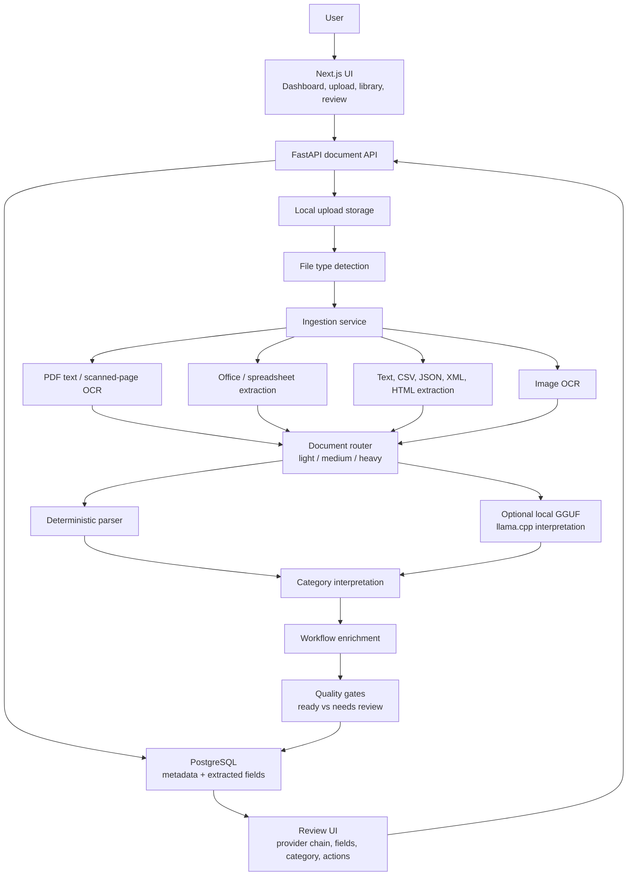

# DocuParse Architecture

DocuParse is organized as a local-first document processing system with a human review loop. The backend owns file ingestion, interpretation, quality checks, and persistence. The frontend owns upload, review, search, category editing, notifications, and workflow visibility.

## System Diagram



## Processing Pipeline

1. **Upload and validation**
   The API accepts an uploaded file, validates the extension against supported types, stores the original file locally, and creates a `Document` row.

2. **File ingestion**
   The ingestion layer normalizes many file families into a common `NormalizedDocument` shape: normalized text, source file type, MIME type, extraction method, warnings, metadata, optional page images, and OCR confidence.

3. **Routing**
   `LightweightDocumentRouter` decides whether a document can stay on a direct/lightweight path or should use heavier interpretation. This keeps simple text and structured files fast while still escalating scanned or low-confidence documents.

4. **Deterministic parsing**
   `DocumentParser` extracts common fields such as title, date, amount, merchant/source, category, tags, and broad internal document type. The rules are transparent and testable.

5. **AI interpretation**
   Optional local interpretation can run through llama.cpp/GGUF. When the model path or runtime is unavailable, the system falls back to heuristic interpretation and records that in the provider chain.

6. **Category and workflow interpretation**
   The interpretation layer refines category, title, summary, profile, subtype, warnings, action items, key dates, and follow-up metadata.

7. **Quality and review**
   Quality gates decide whether a document is ready or needs human review. The UI surfaces review-required documents instead of treating weak extraction as trustworthy.

8. **User correction loop**
   Users can edit title, category, fields, tags, summary, and raw extracted text; confirm documents; reprocess them; or move them back to review.

## Provider Chain

Provider-chain visibility is a core trust/debugging feature. A document may show a chain like:

```text
pdf_text_extract+notice_document_fast_path+heuristic_fallback+heuristic_interpretation+ai_interpretation_gemma_gguf
```

This tells the reviewer:

- how text was extracted
- what processing route was chosen
- whether heuristic fallback participated
- whether local GGUF interpretation participated
- which path produced the final interpretation

This is more portfolio-relevant than hiding the AI step because it shows observability and practical debugging design.

## Review Flow

Documents move through processing statuses:

- `uploaded`
- `queued`
- `processing`
- `ready`
- `needs_review`
- `confirmed`
- `failed`

The frontend uses those states to power:

- dashboard status cards
- needs-review queue
- notifications
- document detail warnings
- confirm / mark-needs-review actions
- category folders and search filters

## Main Tradeoffs

- **Inline processing:** simpler for local development, but long OCR/GGUF jobs can block upload responses.
- **Local storage:** easy to run and inspect, but not designed for multi-user cloud scale.
- **Heuristic-heavy interpretation:** transparent and testable, but needs evaluation and review for edge cases.
- **Derived notifications:** lightweight and reliable for the MVP, but not a full event/audit log.
- **No real auth yet:** appropriate for local-first portfolio scope, but should be called out before public deployment.

## Good Interview Discussion Points

- Why separate ingestion, routing, parsing, interpretation, quality, and workflow enrichment?
- How provider-chain visibility helps debug model or OCR regressions.
- Why local GGUF inference is useful for privacy/local-first workflows.
- How category normalization prevents search/filter mismatches after edits.
- What would change to make processing asynchronous and production-grade.
